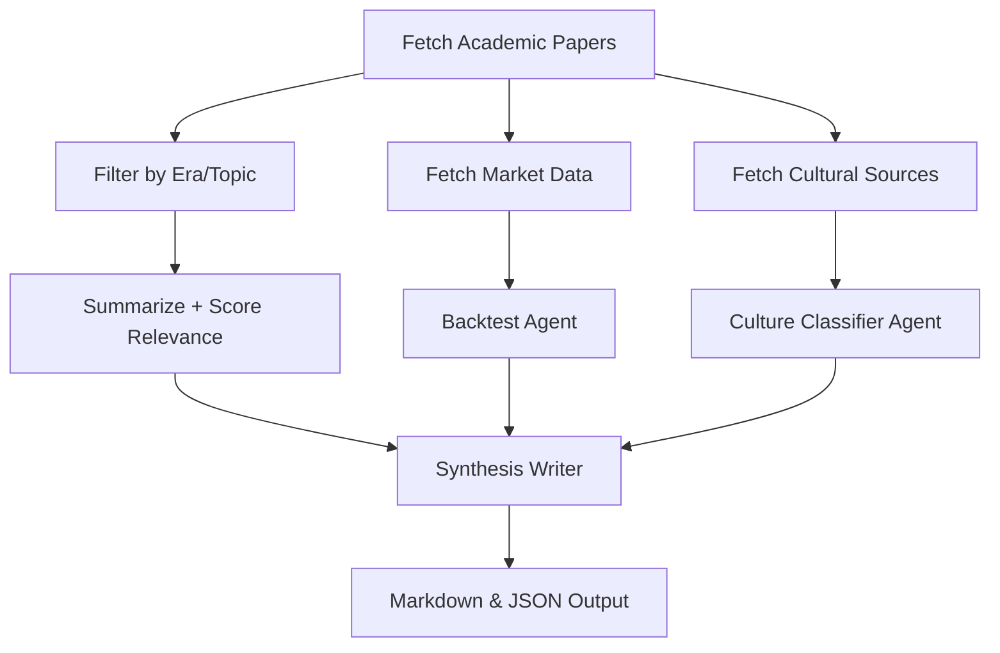

Great question. You’re essentially asking: *how do we study how momentum strategies in markets have evolved alongside changes in technology and culture — and how can agents help make this process more powerful?*

Here’s a structured breakdown of the **research workflow** and how **AI agents** (like the arXiv agent you’re building) can augment each stage.

---

# Researching Momentum’s Evolution in Markets

## 1) Define the Research Question

* **Objective**
  Understand how momentum strategies have changed over time as:

  * **Technology** evolved (algorithmic trading, HFT, big data, machine learning).
  * **Culture** evolved (retail investor participation, social media influence, meme stocks).
* **Specific Questions**

  * Does momentum behave differently in pre-algorithmic vs. post-algorithmic eras?
  * Did cultural shifts (e.g., Reddit, Robinhood) create new forms of short-lived momentum?
  * How do new data sources (alt data, sentiment) interact with traditional momentum factors?

---

## 2) Collect Historical Sources

* **Academic Literature**

  * arXiv, SSRN, and finance journals for factor research papers.
  * Timeline of momentum research (1990s baseline → 2000s quant boom → 2010s ML → 2020s meme stocks).
* **Market Data**

  * CRSP, Compustat, Bloomberg, Quandl, or free Kaggle datasets.
  * Alternative data: Twitter/X feeds, Reddit threads, Google Trends.
* **Cultural/Media Records**

  * News archives, financial blogs, and investor forums.
  * Key events (Dot-com bubble, 2008 crisis, GME short squeeze).

*Agent Use:*

* A **Fetcher Agent** can continuously gather arXiv/SSRN papers with queries like *“momentum factor + deep learning”*, *“momentum and social media”*.
* A **Crawler Agent** can scrape Reddit or financial news archives.

---

## 3) Segment into Eras

* **Pre-digital (1980s–1999):** Institutional quant funds dominate; momentum mostly cross-sectional in equities.
* **Digital trading rise (2000–2009):** Electronic trading, factor ETFs, global spread of quant strategies.
* **Big data + retail surge (2010–2019):** Machine learning enters quant research; Robinhood and Twitter influence behavior.
* **Cultural trading era (2020–present):** Meme stocks, coordinated retail action, AI-driven quant signals.

*Agent Use:*

* **Classifier Agent** can tag each paper/article with its “era” and “technology/cultural context.”
* **Timeline Agent** can generate structured timelines (JSON/markdown) automatically.

---

## 4) Compare Momentum Characteristics Across Eras

* **Performance metrics**
  Sharpe ratios, drawdowns, turnover.
* **Drivers of change**

  * HFT → shorter-lived signals.
  * Machine learning → nonlinear factors.
  * Social media → sentiment-driven micro-momentum.
* **Institutional vs. retail**
  Did retail-driven bursts replace or complement institutional momentum?

*Agent Use:*

* **Analysis Agent** can summarize “what changed in methods/outcomes” for each period.
* **Data Agent** can backtest strategies across decades (using pre-coded Python backtesting libraries) and compare results.

---

## 5) Identify Structural Shifts

* Look for turning points where momentum dynamics changed:

  * Post-2008 (rise of systematic factors and ETF flows).
  * Post-2015 (big data, machine learning).
  * Post-2020 (social trading, meme culture).
* Cross-compare **academic findings** vs **real-world market events**.

*Agent Use:*

* **Cross-Reference Agent**: link arXiv findings to market events (e.g., “2013 paper on high-frequency reversal” ↔ “rise of Virtu & Citadel dominance”).

---

## 6) Synthesize and Generate Insights

* **Narrative Report**

  * Markdown file summarizing “Momentum in the Age of HFT,” “Momentum in the Meme Era.”
* **Structured Data**

  * JSON with fields: {era, tech driver, cultural driver, momentum characteristics, representative papers}.
* **Practical Output**

  * Trading implications: Is momentum weaker now? Does sentiment momentum matter more?

*Agent Use:*

* **Writer Agent**: merges raw summaries into polished Markdown reports.
* **Insight Agent**: extracts “actionable implications” for traders/investors.

---

# How Agents Improve the Research

## 1) Speed and Scale

* Agents can scan thousands of papers, filter relevant ones, and surface only momentum-specific findings.
* They can auto-update weekly with *new arXiv entries* on momentum.

## 2) Structured Knowledge

* Instead of just text dumps, agents produce structured JSON timelines and datasets that can be analyzed programmatically.

## 3) Iterative Discovery

* With a **LangGraph design**, agents can:

  * Fetch → Score relevance → Summarize → Deep dive → Expand queries.
  * Dynamically branch into new areas (e.g., “momentum + sentiment”).

## 4) Multi-Modal Research

* Agents can combine:

  * **Quantitative backtests** on historical stock data.
  * **Qualitative analysis** of cultural shifts.
  * **Cross-validation** between academic research and real-world events.

---

# Example Enhanced Agent Workflow (LangGraph)

---

Goal **building an evolving knowledge system** that tracks how momentum changes as **tech + culture shift**, while agents continuously expand and deepen the research.

